GeneOntologyEnrichment
========================================================
author: Sebastian Kurscheid
date: 2018-10-16
autosize: true

Summary
========================================================

Purpose of the analysis:

- perform GO enrichment for each identified cluster in each of the MCF10A samples
- visual presentation of the results using ClusterProfiler

Slide With Code
========================================================


```r
dataDir <- "/home/sebastian/Data/Collaborations/FSU/PromoterSeqCap/PublicationFigures/Figure_2"
load(file.path(dataDir, "GOAnalysisObjects.rda"))
lapply(names(GOs$MCF10A_WT.clusters), function(x) {
  plotTitle <- x
  z <- GOs$MCF10A_WT.clusters[[x]]
  lapply(names(z), function(y){
    if(nrow(z[[y]]) > 0){
      clusterName <- y
      clusterProfiler::dotplot(z[[y]], title = paste(plotTitle, "-", clusterName, par(cex = 0.5)))
    }
  })
})
```

```
[[1]]
[[1]][[1]]
NULL

[[1]][[2]]
NULL

[[1]][[3]]
NULL


[[2]]
[[2]][[1]]
```

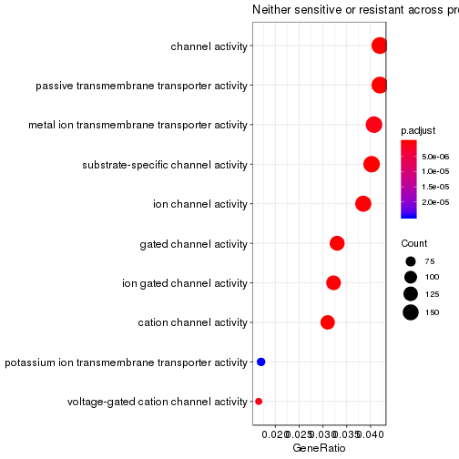

```

[[2]][[2]]
```

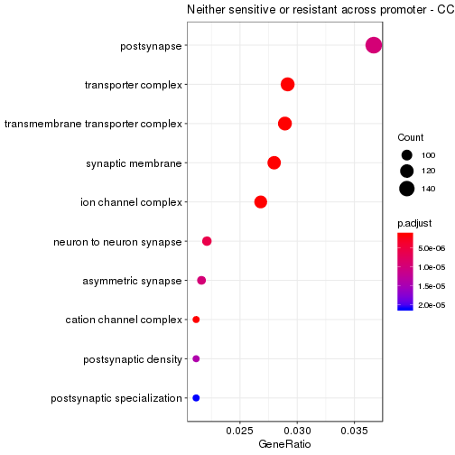

```

[[2]][[3]]
```

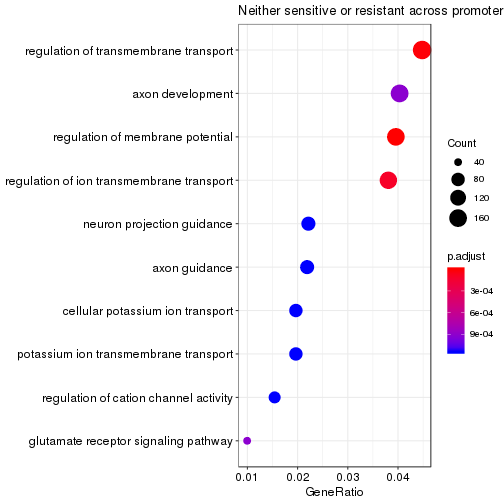

```


[[3]]
[[3]][[1]]
```

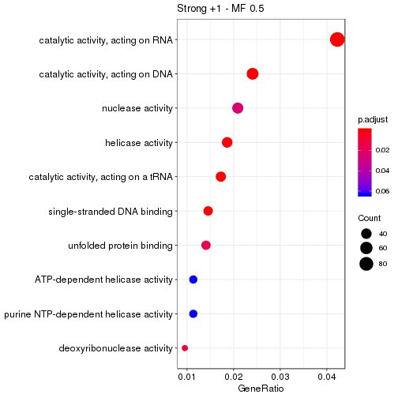

```

[[3]][[2]]
```

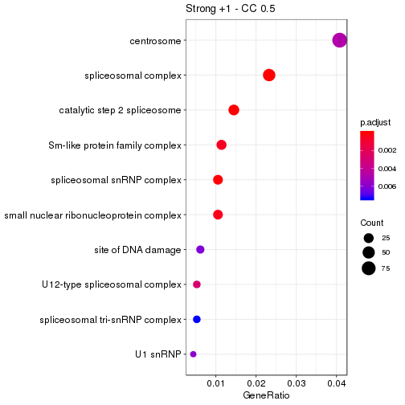

```

[[3]][[3]]
```

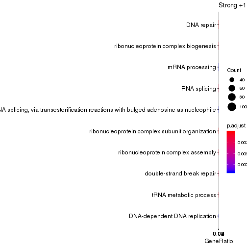

```


[[4]]
[[4]][[1]]
```

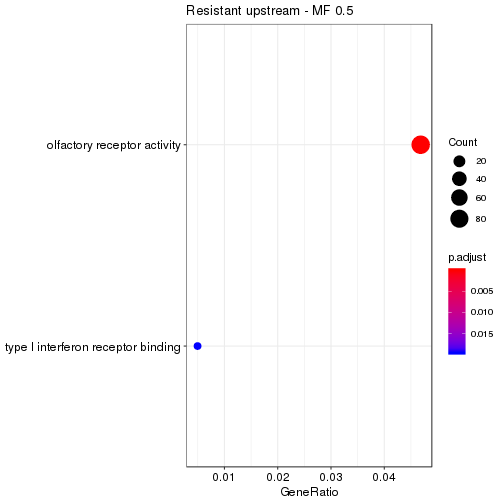

```

[[4]][[2]]
```

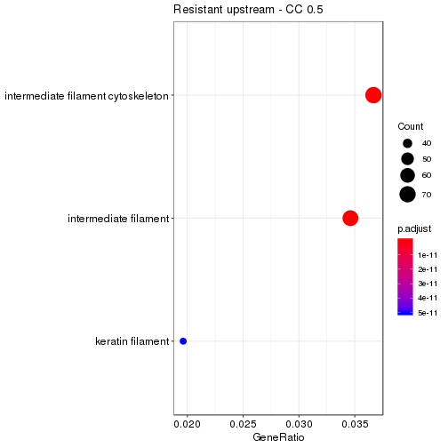

```

[[4]][[3]]
```

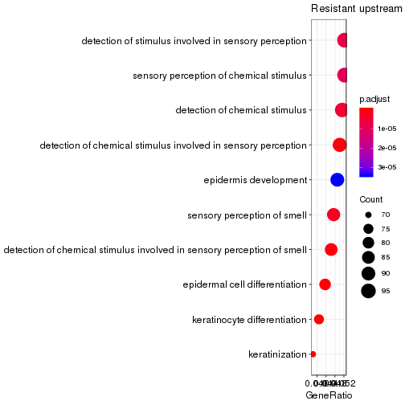

```


[[5]]
[[5]][[1]]
```

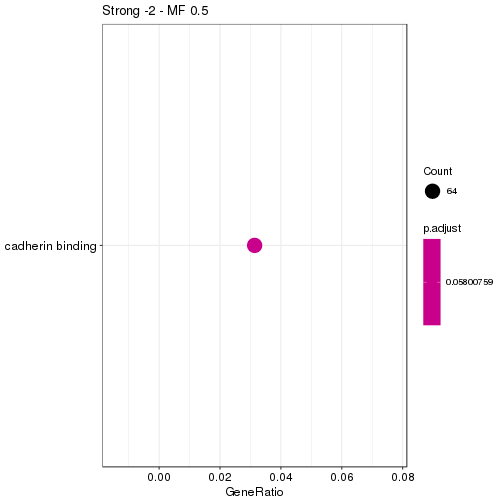

```

[[5]][[2]]
```

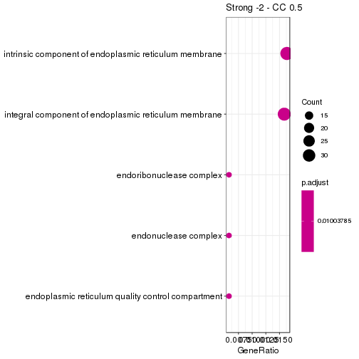

```

[[5]][[3]]
```

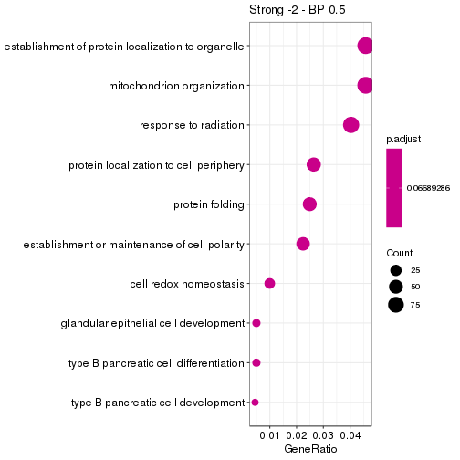

```


[[6]]
[[6]][[1]]
```

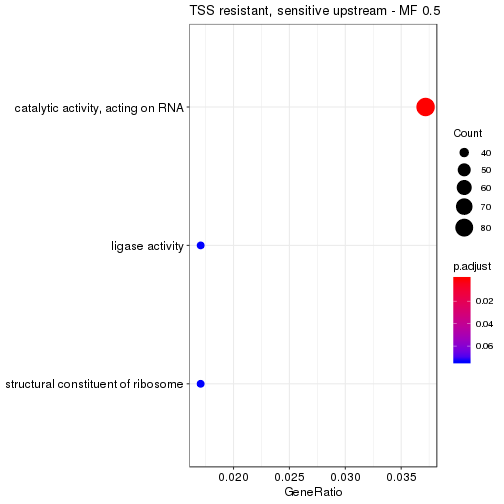

```

[[6]][[2]]
```

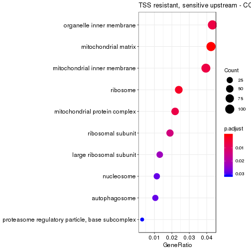

```

[[6]][[3]]
```

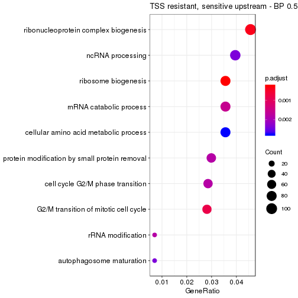

```


[[7]]
[[7]][[1]]
```

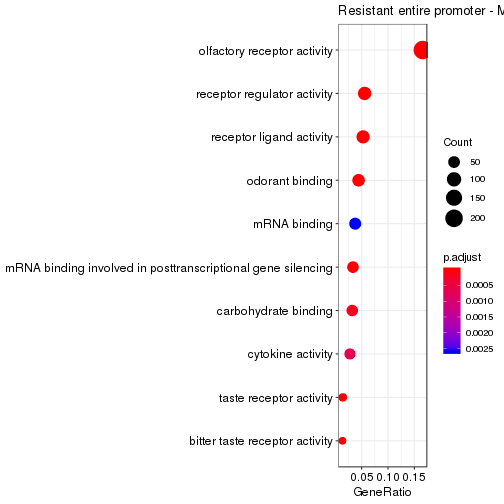

```

[[7]][[2]]
```

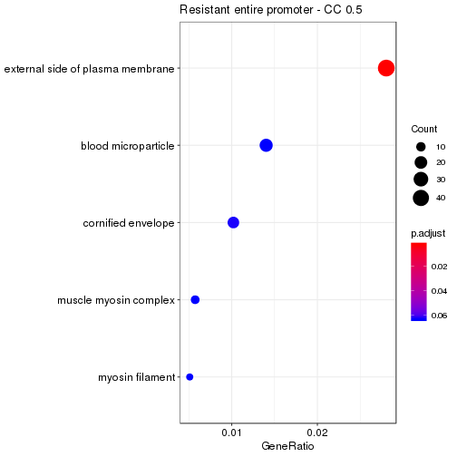

```

[[7]][[3]]
```

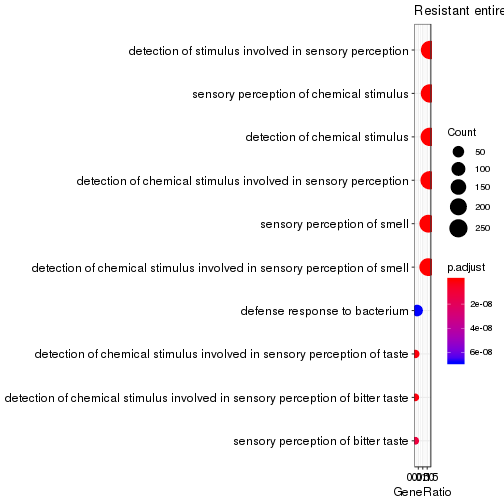

Slide With Plot
========================================================


